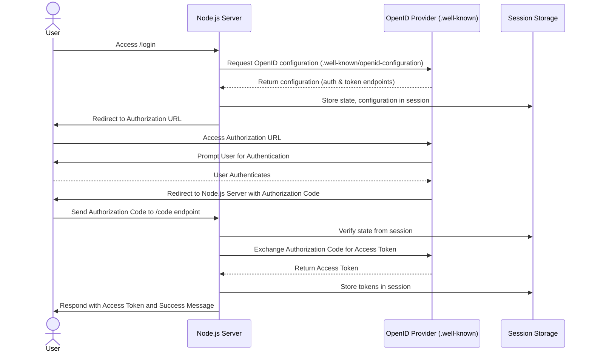

# WebChart OAuth Example

[](https://github.com/mieweb/webchart-oauth-example/actions/workflows/node.js.yml)


A Node.js application demonstrating OAuth2 and OpenID Connect authentication flows for WebChart's FHIR interface. This project showcases two implementations:
1. **Simple OAuth2 Flow** (webchart-example.js)
2. **OpenID Connect Flow** (webchart-example_openid.mjs)

Both flows allow users to authenticate with `fhirr4sandbox.webch.art`, retrieve tokens, and store session data securely.

---

## Features

### Simple OAuth2 Flow
- Demonstrates basic OAuth2 authorization and token exchange.
- Uses session management for storing tokens and state.
- Implements token retrieval using an authorization code grant.

### OpenID Connect Flow
- Enhances the OAuth2 flow with OpenID Connect for identity management.
- Discovers provider metadata dynamically from the `.well-known` endpoint.
- Implements state verification and token exchange with a secure redirect.

### Sequence Diagram 

---

## Getting Started

Follow these steps to set up and run the project locally.

### Prerequisites
- **Node.js** (v16 or higher)
- **npm** (v8 or higher)
- Internet connection for accessing `fhirr4sandbox.webch.art`

### Installation
1. Clone the repository:
   ```bash
   git clone https://github.com/mieweb/webchart-oauth-example.git
   cd webchart-oauth-example
   ```

2. Install dependencies:
   ```bash
   npm install
   ```

3. Set up environment variables:
   Create a `.env` file in the root directory and add:
   ```env
   CLIENT_ID='client id'
   CLIENT_SECRET='client secret'
   PUPPET_PASS='puppeteer password'
   ```

---

## Usage

### Running the Application
Start the server with:
```bash
npm start
```

Access the following endpoints:
- **Simple OAuth Flow**: `http://localhost:8080/login`
- **OpenID Connect Flow**: `http://localhost:8080/login`

---

## Testing

### Interactive Test Selection
Run the following command to choose which test to execute:
```bash
npm test
```

You’ll be prompted to select one of the following:
1. **Default Test**: Tests the Simple OAuth2 flow.
2. **OpenID Test**: Tests the OpenID Connect flow.

### Puppeteer Integration
Automated tests are implemented using Puppeteer:
- `puppeteer-test.js`: Validates the Simple OAuth2 flow.
- `puppeteer-test_openid.js`: Validates the OpenID Connect flow.

---

## Project Structure

- **`webchart-example.js`**: Implements the Simple OAuth2 flow.
- **`webchart-example_openid.mjs`**: Implements the OpenID Connect flow.
- **`puppeteer-test.js`**: Automated test script for the Simple OAuth2 flow.
- **`puppeteer-test_openid.js`**: Automated test script for the OpenID Connect flow.
- **`package.json`**: Configures scripts and dependencies for the project.

---

## Documentation

For detailed API and OAuth2 protocol documentation, refer to:
- [WebChart OAuth2 Tutorial](https://docs.webchartnow.com/resources/system-specifications/fhir-application-programming-interface-api/oauth-2.0-tutorial/)
- [EnterpriseHealth OAuth2 Tutorial](https://docs.enterprisehealth.com/resources/system-specifications/fhir-application-programming-interface-api/oauth-2.0-tutorial/)

Here is the video showing the code flow:

- **OAuth**:


[](https://youtu.be/-YaW9Qa5wvc)
- **OpenID**:


[](https://youtu.be/jqhS8GgddO4)
---

## Contributing

Contributions are welcome! Feel free to submit issues or pull requests for enhancements and bug fixes.

---

## License

This project is licensed under the ISC License. See the `LICENSE` file for details.
