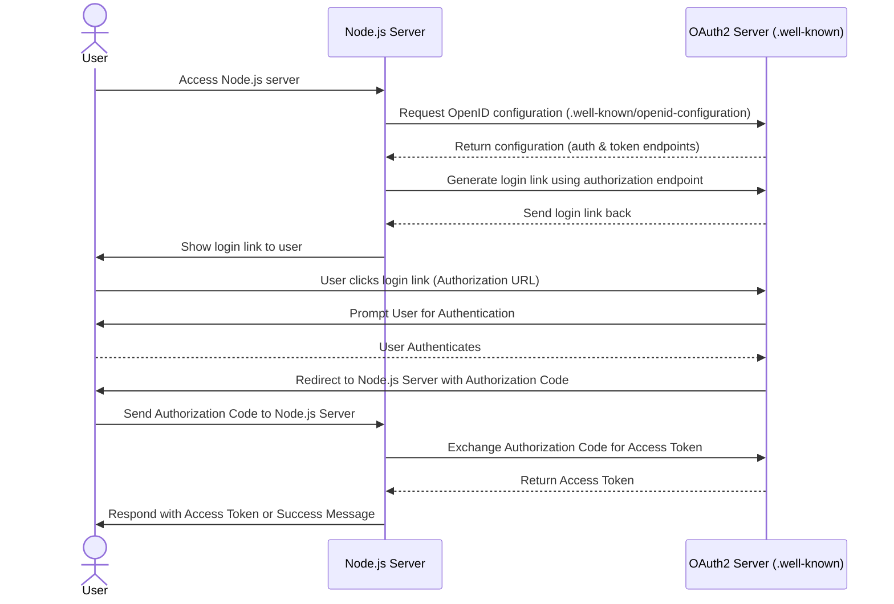

# webchart-oauth-example

Example OAuth2 token

This starts a webserver on localhost, allows someone to connect, then connects to fhirr4sandbox.webch.art and promoted the Authorization token to a session token.

## Documentation

* https://docs.webchartnow.com/resources/system-specifications/fhir-application-programming-interface-api/oauth-2.0-tutorial/
* https://docs.enterprisehealth.com/resources/system-specifications/fhir-application-programming-interface-api/oauth-2.0-tutorial/

## Sequence Diagram 

